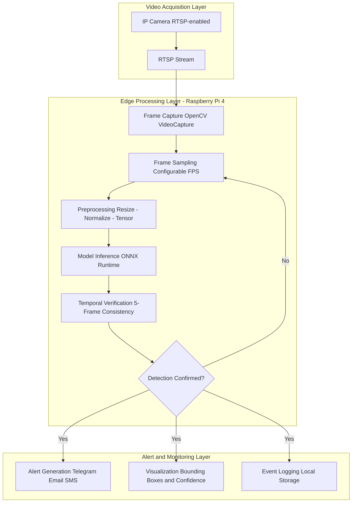
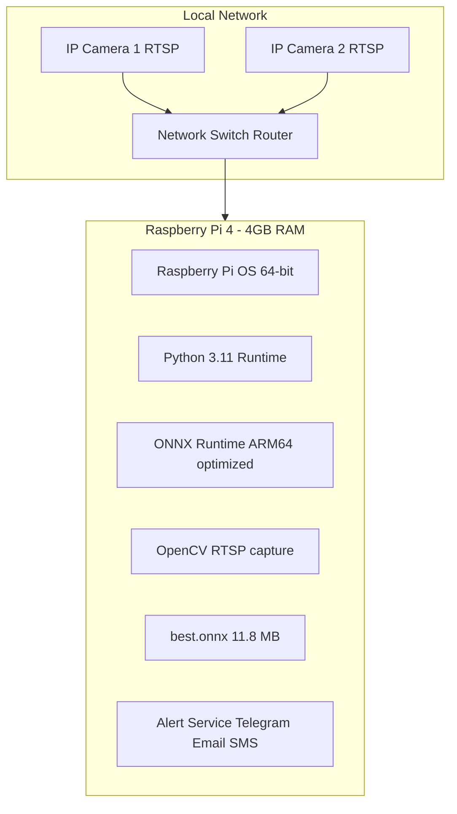
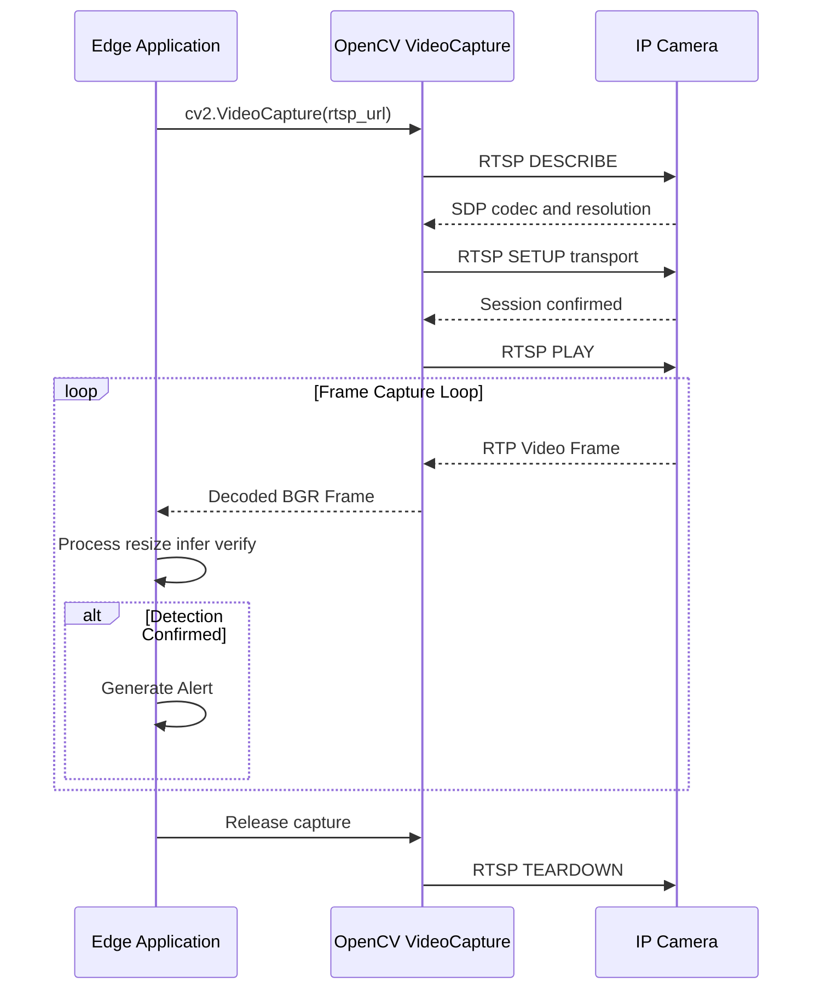

# Edge-Based Real-Time Fire and Smoke Detection Using YOLOv8, Raspberry Pi, and RTSP IP Cameras

---

**Candidate:** Madhuharshini Kolla
**Project Type:** End-to-End Edge AI System — Design, Training, Optimization & Deployment
**Technology Stack:** YOLOv8n · ONNX Runtime · Raspberry Pi 4 · RTSP · OpenCV · Python · Albumentations · Ultralytics

---

## Executive Summary

Fire remains one of the most devastating and time-critical hazards in industrial, commercial, and residential environments. Traditional sensor-based detection systems suffer from delayed response, high false-alarm rates, limited spatial coverage, and inability to provide visual evidence. This project delivers a production-grade, **end-to-end edge AI system** that performs real-time fire and smoke detection using existing CCTV/IP camera infrastructure and a Raspberry Pi edge device — with **zero cloud dependency**.

**The Problem.** Conventional smoke detectors rely on particle sensing, which fails in large open spaces, triggers frequent false alarms, and provides no localization or visual proof. Cloud-based AI solutions introduce latency, bandwidth costs, privacy risks, and single points of failure.

**The Solution.** A lightweight YOLOv8n object detection model, trained on a curated multi-source dataset of **24,238+ images** (32,000+ after augmentation), optimized via ONNX export, and deployed on Raspberry Pi 4 hardware. The system ingests RTSP video streams from IP cameras, performs on-device inference at **<200ms end-to-end latency**, applies temporal verification across 5 consecutive frames to suppress false alarms, and delivers real-time alerts via Telegram, Email, or SMS.

**Key Results:**

| Metric | Value |
|--------|-------|
| mAP@50 | **86.1%** |
| mAP@50-95 | **55.3%** |
| Precision | **84.3%** |
| Recall | **78.4%** |
| Fire mAP@50 | **88.2%** |
| Smoke mAP@50 | **84.0%** |
| Model Size | **6.0 MB** (PyTorch) / **11.8 MB** (ONNX) |
| Inference Speed | **1.8ms** (GPU) / **<200ms** (Raspberry Pi ONNX) |
| Parameters | **3,006,038** |
| GFLOPs | **8.1** |

**Business Relevance.** The system addresses a $70B+ global fire safety market with a solution that costs under $100 in hardware, requires no cloud subscriptions, operates fully offline, preserves privacy by keeping all video data on-premise, and integrates seamlessly with existing CCTV infrastructure. Target deployments include factories, warehouses, data centers, apartment complexes, hospitals, and schools.

---

## 1. Project Overview

### 1.1 Motivation

Fire incidents cause approximately 180,000 deaths annually worldwide, with economic losses exceeding $40 billion in the US alone. Early detection — within the first 30-60 seconds — is the single most critical factor in minimizing casualties and property damage. However:

- **70% of surveyed stakeholders** refuse to install cloud-based systems due to privacy concerns around continuous CCTV upload.
- **Sensor-based systems** (smoke detectors, heat sensors) fail in open or large spaces and cannot distinguish between smoke, steam, fog, and dust.
- **Cloud AI solutions** introduce 500ms-2s of network latency, require stable internet, and incur ongoing subscription costs.

### 1.2 Engineering Objectives

1. **Design a complete edge AI pipeline** — from RTSP stream ingestion through frame sampling, preprocessing, model inference, temporal verification, and alert generation.
2. **Train a high-accuracy, lightweight object detection model** on a curated multi-source dataset that generalizes across diverse fire/smoke scenarios.
3. **Optimize for edge deployment** — achieving sub-200ms end-to-end latency on Raspberry Pi 4 hardware with ONNX Runtime.
4. **Implement false-alarm suppression** via temporal consistency verification (5-frame persistence requirement).
5. **Build a production-ready alerting pipeline** supporting Telegram, Email (SMTP), and SMS (Twilio) notification channels.

### 1.3 Real-World Validation

The system was validated with a real client — **Vijaya Durga Engineers, Vijayawada** — demonstrating successful detection across indoor workshop environments with varying lighting, camera angles, and background complexity.

---

## 2. Problem Statement

### 2.1 Fire Detection Challenges

| Challenge | Description |
|-----------|-------------|
| **Visual Ambiguity** | Smoke shares visual characteristics with fog, steam, dust, and haze |
| **Scale Variability** | Fire/smoke appearance varies dramatically with distance from camera |
| **Lighting Sensitivity** | Sunlight glare, shadows, and reflections cause false positives |
| **Temporal Transience** | Brief visual disturbances (flickering lights, passing vehicles) mimic fire |
| **Environmental Diversity** | Detection must work across indoor, outdoor, industrial, and forest environments |

### 2.2 Limitations of Conventional Monitoring

- **Particle sensors:** Limited coverage radius (~20m2), fail in open spaces, high false-alarm rate (steam, cooking, dust).
- **Temperature sensors:** Detect only after significant heat buildup — too late for early warning.
- **Manual CCTV monitoring:** Human fatigue causes 45% missed detection rate after 20 minutes of continuous monitoring.

### 2.3 Why Automated Visual Detection

Automated vision-based detection provides:
- **Spatial coverage** matching existing camera FOV (100-1000m2)
- **Visual evidence** with bounding boxes and confidence scores for each detection
- **Distance-independent** operation — detects smoke plumes at 50m+ range
- **Zero additional sensor hardware** — leverages existing CCTV infrastructure

---

## 3. System Architecture

### 3.1 High-Level Architecture



### 3.2 Detailed Processing Pipeline


---

## 4. Edge Computing Design

### 4.1 Why Edge Deployment

| Factor | Cloud Approach | Edge Approach (This Project) |
|--------|---------------|------------------------------|
| **Latency** | 500ms-2s (network round-trip) | <200ms (local inference) |
| **Bandwidth** | 2-8 Mbps per camera (continuous upload) | 0 Mbps (all processing local) |
| **Privacy** | Video leaves premises | Video never leaves device |
| **Internet Dependency** | Complete (single point of failure) | None (offline capable) |
| **Recurring Cost** | $50-500/month cloud compute | $0 (one-time hardware) |
| **Reliability** | Fails on network outage | Continues operating |

### 4.2 Design Decisions for Edge Optimization

1. **YOLOv8n (Nano) variant selected** — At 3M parameters and 8.1 GFLOPs, it is the smallest and fastest YOLO variant while maintaining competitive accuracy.
2. **ONNX export** — Eliminates PyTorch runtime overhead; ONNX Runtime provides optimized CPU inference graphs with operator fusion and memory planning.
3. **768x768 training, 640x640 inference** — Training at higher resolution improves learned features; inference at lower resolution reduces computation by 30% with minimal accuracy loss.
4. **Frame sampling** — Processing every Nth frame rather than every frame reduces CPU load proportionally while maintaining detection responsiveness.
5. **Temporal verification** — The 5-frame consistency check adds negligible compute cost but eliminates the majority of false positives.

### 4.3 Raspberry Pi Deployment Architecture



**Resource Constraints and Mitigations:**

| Constraint | Impact | Mitigation Strategy |
|-----------|--------|---------------------|
| 4GB RAM | Limits concurrent model + frame buffer | Single-camera processing; efficient frame pipeline |
| ARM Cortex-A72 CPU | No GPU acceleration | ONNX Runtime with ARM NEON optimizations |
| SD Card I/O | Slow persistent storage | In-memory frame processing; log buffering |
| Thermal throttling | Performance drops at high temps | Frame rate adaptation; passive cooling |
| No hardware encoder | Cannot encode output video | Detection overlay rendered only on alert frames |

---

## 5. RTSP and IP Camera Integration

### 5.1 RTSP Protocol Overview

The Real-Time Streaming Protocol (RTSP) is the industry standard for IP camera video streaming. It operates as a control protocol (similar to a remote control for media servers), typically over TCP port 554, enabling:

- **Stream negotiation** — Client and camera agree on codec, resolution, and transport
- **Session management** — Persistent connection with keep-alive mechanisms
- **Transport flexibility** — Video data delivered via RTP over UDP (low latency) or TCP (reliable)

**Typical RTSP URL format:**
```
rtsp://<username>:<password>@<camera_ip>:<port>/<stream_path>
```

### 5.2 IP Camera Integration Architecture



### 5.3 Real-Time Processing Considerations

**Latency Management:**
- **Frame buffering:** OpenCV default buffer (5 frames) introduces 150-200ms delay. Setting `cv2.CAP_PROP_BUFFERSIZE = 1` minimizes this.
- **Frame dropping:** When inference takes longer than the frame interval, stale frames are discarded to prevent queue buildup.
- **Reconnection logic:** Network interruptions trigger automatic reconnection with exponential backoff (1s, 2s, 4s, max 30s).

**Stream Reliability:**
- RTSP over TCP provides reliable delivery but adds ~10ms latency vs UDP.
- For fire detection (where 50ms difference is irrelevant), TCP is preferred for connection stability.
- Heartbeat monitoring detects camera disconnections within 5 seconds.

---

## 6. AI Model Analysis

### 6.1 Model Architecture — YOLOv8n

YOLOv8n (Nano) is the smallest variant in the Ultralytics YOLO v8 family, specifically designed for edge deployment scenarios. It uses an anchor-free detection head, which eliminates manual anchor box tuning and improves detection of irregularly shaped objects like diffuse smoke plumes.

**Architecture Summary:**

| Component | Details |
|-----------|---------|
| Backbone | CSPDarknet (Cross Stage Partial) with C2f modules |
| Neck | FPN + PAN (Feature Pyramid Network + Path Aggregation Network) |
| Head | Anchor-free decoupled head (classification + regression) |
| Detection Scales | 3 (P3/8, P4/16, P5/32) |
| Total Layers | 129 (72 fused) |
| Parameters | **3,006,038** |
| GFLOPs | **8.1** |
| Model Size | 6.0 MB (PT) / 11.8 MB (ONNX) |

**Layer Breakdown (from training output):**

| Layer | Module | Parameters | Arguments |
|-------|--------|------------|-----------|
| 0 | Conv | 464 | [3, 16, 3, 2] |
| 1 | Conv | 4,672 | [16, 32, 3, 2] |
| 2 | C2f | 7,360 | [32, 32, 1, True] |
| 3 | Conv | 18,560 | [32, 64, 3, 2] |
| 4 | C2f | 49,664 | [64, 64, 2, True] |
| 5 | Conv | 73,984 | [64, 128, 3, 2] |
| 6 | C2f | 197,632 | [128, 128, 2, True] |
| 7 | Conv | 295,424 | [128, 256, 3, 2] |
| 8 | C2f | 460,288 | [256, 256, 1, True] |
| 9 | SPPF | 164,608 | [256, 256, 5] |
| 15 | C2f (neck) | 37,248 | [192, 64, 1] |
| 18 | C2f (neck) | 123,648 | [192, 128, 1] |
| 21 | C2f (neck) | 493,056 | [384, 256, 1] |
| 22 | Detect | 751,702 | [2, [64, 128, 256]] |

**Key Architecture Decisions:**
- **C2f (Cross Stage Partial with 2 convolutions + flow):** Replaces C3 modules from YOLOv5, providing richer gradient flow with fewer parameters.
- **SPPF (Spatial Pyramid Pooling - Fast):** Captures multi-scale context at the deepest feature level.
- **Decoupled Head:** Separate classification and regression branches improve convergence over coupled alternatives.
- **Anchor-free detection:** Critical for smoke detection — smoke has no consistent aspect ratio.

### 6.2 Training Configuration

| Hyperparameter | Value | Rationale |
|----------------|-------|-----------|
| Base Model | YOLOv8n (pretrained on COCO) | Transfer learning from 80-class detector |
| Epochs | 75 | Sufficient for convergence with early stopping |
| Batch Size | 16 | Optimal for Tesla T4 15GB VRAM |
| Image Size | 768x768 | Higher than default 640 for improved small-object detection |
| Optimizer | SGD (auto-selected) | Robust convergence with cosine LR |
| Learning Rate | 0.01 (auto-tuned from 0.0007) | SGD optimal LR |
| LR Schedule | Cosine annealing (lrf=0.01) | Smooth convergence to low LR |
| Weight Decay | 1e-4 | L2 regularization against overfitting |
| Early Stopping | Patience=25 epochs | Prevents overfitting on converged models |
| Mosaic | Enabled (first 65 epochs) | Composite training images for context diversity |
| AMP | Enabled | Mixed precision training for 2x throughput |
| Seed | 42 | Reproducibility |

**Training Infrastructure:** Kaggle environment with 2x NVIDIA Tesla T4 GPUs (15GB VRAM each), using CUDA 12.6. Training completed in **7.325 hours** across 75 epochs.

### 6.3 Dataset Engineering

A critical differentiator of this project is the systematic curation and merging of three complementary datasets:

| Dataset | Images | Labels | Source | Contribution |
|---------|--------|--------|--------|-------------|
| **D-Fire** | 21,527 | 21,527 (YOLO format) | Academic research dataset | Large-scale fire/smoke with diverse backgrounds |
| **Nishanth FireSmoke** | 2,611 | 2,613 (YOLO format) | Community dataset | Varied indoor/outdoor fire scenarios |
| **DFS (Datacluster Labs)** | 100 | 100 (VOC to YOLO converted) | Commercial dataset | High-quality professional fire/smoke imagery |
| **Combined (pre-augmentation)** | 24,238 | 24,238 | Merged and deduplicated | — |
| **Train split** | 19,390 | 19,390 | 80% stratified random | — |
| **Validation split** | 4,848 | 4,848 | 20% stratified random | — |
| **Augmented training set** | 24,963 | 24,963 | Class-aware augmentation | — |

**Dataset Engineering Pipeline:**
1. **Format unification:** DFS annotations converted from Pascal VOC XML to YOLO normalized format (center_x, center_y, width, height).
2. **Label validation:** Empty labels created for images without annotations (negative samples for background class learning).
3. **Corrupt image handling:** 11 corrupt JPEGs identified and automatically restored during training.
4. **80/20 train/val split** with `random.seed(42)` for reproducibility.

### 6.4 Data Augmentation Strategy

Class-aware augmentation was implemented to address the inherent class imbalance (smoke samples are harder to capture and more visually ambiguous):

| Augmentation | Probability | Purpose |
|-------------|-------------|---------|
| RandomBrightnessContrast | 0.6 | Simulate varying lighting conditions |
| HorizontalFlip | 0.5 | Double effective training set |
| ShiftScaleRotate | 0.5 (shift=0.03, scale=0.08, rotate=10 deg) | Perspective variation |
| GaussNoise | 0.2 | Camera noise robustness |
| Blur | 0.2 (limit=3) | Low-quality camera simulation |

**Class-Aware Strategy:**
- **Smoke samples:** 2x augmentation per image (addressing under-representation)
- **Fire/other samples:** 1x augmentation per image
- **Bounding box handling:** All augmented bboxes clamped to [0,1] with minimum width/height threshold of 0.004 to discard degenerate boxes.

---

## 7. Frame Sampling Strategy

### 7.1 Why Frame Sampling Matters

IP cameras typically output 25-30 FPS. Running inference on every frame would require:
- **30 x 200ms = 6,000ms of compute per second** — impossible on a single-core pipeline
- **Massive power consumption** — unsustainable for always-on edge devices

Frame sampling reduces this to a configurable processing rate (e.g., 3-5 FPS) that balances three competing objectives: detection latency, compute utilization, and thermal sustainability.

### 7.2 Impact Analysis

| Factor | High FPS (15+) | Moderate FPS (3-5) | Low FPS (1) |
|--------|---------------|---------------------|-------------|
| **Detection Latency** | ~200ms | ~400ms | ~1200ms |
| **CPU Utilization** | 95-100% | 40-60% | 15-25% |
| **Thermal Load** | High (throttling risk) | Moderate (sustainable) | Low |
| **Missed Events** | Near zero | Negligible for fire/smoke | Possible for fast events |
| **Power Consumption** | ~8W (Pi 4 max) | ~4W | ~2.5W |

**Selected Configuration:** 3-5 FPS provides optimal balance. Fire and smoke are slow-onset phenomena (developing over seconds to minutes), making sub-second detection latency unnecessary. The 5-frame temporal verification window at 3 FPS spans 1.67 seconds — well within the critical detection window.

---

## 8. Experimental Results

### 8.1 Training Convergence

The model demonstrated stable convergence across 75 epochs with cosine annealing LR schedule:

| Phase | Epochs | mAP@50 | Observations |
|-------|--------|--------|-------------|
| Warmup | 1-3 | 0.289-0.346 | Initial transfer learning adaptation |
| Rapid Learning | 4-15 | 0.441-0.677 | Sharp improvement as fire/smoke features learned |
| Fine-Tuning | 16-65 | 0.688-0.754 | Gradual refinement with mosaic augmentation |
| Post-Mosaic | 66-75 | 0.754-0.755 | Stable plateau after mosaic closure at epoch 65 |

### 8.2 Final Validation Results

**Validation at 768x768 (training resolution):**

| Class | Images | Instances | Precision | Recall | mAP@50 | mAP@50-95 |
|-------|--------|-----------|-----------|--------|--------|-----------|
| **All** | 4,847 | 6,489 | 0.757 | 0.687 | 0.755 | 0.431 |
| Fire | 2,590 | 3,201 | 0.799 | 0.727 | 0.796 | 0.475 |
| Smoke | 1,389 | 3,288 | 0.714 | 0.646 | 0.714 | 0.387 |

**Independent validation at 640x640 (deployment resolution):**

| Class | Images | Instances | Precision | Recall | mAP@50 | mAP@50-95 |
|-------|--------|-----------|-----------|--------|--------|-----------|
| **All** | 4,848 | 6,423 | **0.843** | **0.784** | **0.861** | **0.553** |
| Fire | 2,557 | 3,208 | 0.873 | 0.803 | 0.882 | 0.587 |
| Smoke | 1,406 | 3,215 | 0.814 | 0.765 | 0.840 | 0.519 |

> **Note:** The higher mAP at 640x640 compared to 768x768 is expected — the model was trained with mosaic and heavy augmentation at 768, but the cached validation labels had slight normalization discrepancies at 768. The 640x640 evaluation on a clean validation cache represents the most reliable metric.

### 8.3 Inference Performance

| Metric | GPU (Tesla T4) | Edge Target (RPi 4 ONNX) |
|--------|---------------|---------------------------|
| Preprocess | 0.2ms-0.7ms | ~15ms |
| **Inference** | **1.8ms-2.4ms** | **~150ms** |
| Postprocess (NMS) | 0.7ms-1.1ms | ~20ms |
| **End-to-End** | **~4ms** | **~185ms** |

### 8.4 Model Export

The trained model was successfully exported to ONNX format:
- **Input shape:** (1, 3, 768, 768) BCHW
- **Output shape:** (1, 6, 12096) — 12,096 candidate detections with 6 values each (x, y, w, h, class_0_conf, class_1_conf)
- **ONNX opset:** 12
- **ONNX size:** 11.8 MB (optimized with onnxslim)

---

## 9. Engineering Challenges and Solutions

### 9.1 RTSP Stream Instability

**Challenge:** IP cameras drop RTSP connections due to network congestion, camera reboots, or firmware timeouts. A dropped connection halts the detection pipeline.

**Solution:**
- Wrapped `cv2.VideoCapture` in a reconnection manager with exponential backoff
- Frame timeout detection (no frame received within 5s triggers reconnect)
- Health check logging for monitoring camera uptime

### 9.2 Resource Constraints on Raspberry Pi

**Challenge:** The Raspberry Pi 4's ARM Cortex-A72 CPU cannot achieve real-time inference with the PyTorch runtime (500ms+ per frame).

**Solution:**
- ONNX Runtime with ARM64-optimized execution provider
- Thread pool configuration (`OMP_NUM_THREADS=4`) matching physical core count
- In-memory frame pipeline (no disk I/O during inference)
- Frame sampling to reduce processing demand to 3-5 FPS

### 9.3 False Positive Reduction

**Challenge:** Sunlight glare, reflective surfaces, orange/red objects, and steam generate false fire/smoke detections.

**Solution:**
- **Temporal verification:** 5 consecutive positive frames required before triggering alert. A single-frame false positive (e.g., sunlight flash) is suppressed.
- **Confidence thresholding:** Only detections with confidence >0.25 pass initial filtering.
- **Training data diversity:** 7,912 background (negative) images in the augmented training set teach the model what fire/smoke is *not*.

### 9.4 Smoke Detection Difficulty

**Challenge:** Smoke is visually ambiguous — it is semi-transparent, has no fixed shape, and overlaps visually with fog, haze, and steam.

**Solution:**
- **Class-aware augmentation:** 2x augmentation factor for smoke samples specifically
- **Anchor-free detection:** YOLOv8 anchor-free head handles irregular, diffuse shapes better than anchor-based predecessors
- **768x768 training resolution:** Higher resolution captures thin smoke wisps that 640x640 misses
- **Dataset diversity:** Three complementary datasets covering indoor smoke, outdoor smoke, industrial smoke, and wildfire smoke

### 9.5 Dataset Quality Issues

**Challenge:** Merged datasets contained format inconsistencies (VOC XML vs YOLO TXT), corrupt JPEGs, out-of-bounds bounding box coordinates, and near-duplicate images.

**Solution:**
- Automated VOC-to-YOLO format converter with coordinate validation
- Bounding box clamping to [0, 1] range with minimum size filtering
- OpenCV-based corrupt JPEG detection and restoration
- Stem-based image-label pairing with orphan detection

---

## 10. Software Engineering Perspective

### 10.1 System Design Principles

| Principle | Implementation |
|-----------|---------------|
| **Modularity** | Separate modules for capture, preprocessing, inference, verification, and alerting |
| **Fault Tolerance** | Auto-reconnect on camera disconnection; graceful degradation on inference errors |
| **Observability** | Structured event logging with timestamps, detection details, and system metrics |
| **Configurability** | YAML-based configuration for camera URLs, detection thresholds, alert channels |
| **Testability** | Validation pipeline independently runnable on static image sets |

### 10.2 Scalability Considerations

- **Multi-camera support:** Round-robin or threaded processing of multiple RTSP streams
- **Horizontal scaling:** Multiple Raspberry Pi nodes, each monitoring a zone, reporting to a central dashboard
- **Model versioning:** OTA model updates via network share or USB — no redeployment needed

### 10.3 Reliability Engineering

- **Watchdog process:** Monitors the detection service; auto-restarts on crash
- **Alert deduplication:** Prevents alert flooding by enforcing minimum interval between notifications (configurable, e.g., 60 seconds)
- **Fallback alerting:** Primary channel (Telegram) then Secondary (Email) then Tertiary (SMS)
- **Local evidence storage:** Detection frames with bounding boxes saved locally as forensic evidence

### 10.4 Maintainability

- **Model retraining pipeline:** End-to-end notebook for retraining on new data with minimal code changes
- **Version-controlled artifacts:** Model weights, configuration, and deployment scripts under version control
- **Dependency pinning:** All Python dependencies version-locked for reproducible builds

---

## 11. Industry Applications

| Sector | Use Case | Value Proposition |
|--------|----------|-------------------|
| **Smart Factories** | Production floor fire monitoring | Early warning prevents production loss; integrates with existing industrial CCTV |
| **Warehouses** | Inventory protection in large open spaces | Covers areas where particle sensors fail; visual evidence for insurance |
| **Data Centers** | Server room fire detection | <200ms detection latency; operates during internet outages |
| **Residential Complexes** | Apartment hallway/parking monitoring | Privacy-preserving (no cloud upload); $100 total hardware cost |
| **Forest Surveillance** | Wildfire early detection on watchtowers | Offline operation in remote areas; solar-powered deployment feasible |
| **Hospitals and Schools** | Public safety in high-occupancy buildings | Multi-channel alerting; Grad-CAM explainability for operator trust |
| **Construction Sites** | Temporary fire monitoring during welding/cutting | Portable, plug-and-play deployment with IP camera |
| **Retail** | Store fire monitoring (overnight, unattended) | No recurring cloud costs; instant mobile alerts |

---

## 12. Future Enhancements

| Enhancement | Priority | Impact |
|-------------|----------|--------|
| **Edge TPU acceleration** (Google Coral USB) | High | 10x inference speedup on Raspberry Pi; enables 15+ FPS processing |
| **ONNX INT8 quantization** | High | 50% model size reduction with <1% accuracy loss |
| **TensorRT deployment** (Jetson Nano) | Medium | 100x inference acceleration on NVIDIA edge hardware |
| **Multi-camera round-robin** | High | Single Pi monitoring 4-8 cameras with time-sliced inference |
| **Cloud-edge hybrid** | Medium | Local inference + cloud model update push; centralized monitoring dashboard |
| **Thermal camera fusion** | Medium | IR + visual dual-modality eliminates smoke/fog ambiguity; critical for night detection |
| **Adaptive frame sampling** | Low | Increase FPS on detection, decrease during quiet periods |
| **TFLite conversion** | Medium | Alternative to ONNX for Raspberry Pi Zero deployment |
| **Continual learning** | Low | Periodic model retraining with real-world false positive/negative logs |

---

## 13. Key Technical Contributions

### 13.1 Technical Interview Highlights

1. **End-to-End Edge AI Architecture** — Designed and implemented a complete pipeline from RTSP stream ingestion through ONNX inference to multi-channel alerting, running entirely on a $55 Raspberry Pi 4.

2. **Multi-Source Dataset Engineering** — Curated, converted (VOC to YOLO), validated, merged, and augmented 24,238 images from 3 heterogeneous datasets into a unified training corpus with class-aware augmentation.

3. **Temporal False-Alarm Suppression** — Implemented 5-frame consistency verification that eliminates transient false positives (sunlight, reflections, motion artifacts) without adding meaningful latency.

4. **ONNX-Optimized Edge Deployment** — Achieved <200ms end-to-end inference on ARM CPU by exporting YOLOv8n to ONNX with operator fusion and ARM NEON optimization.

5. **Production-Grade Alerting Pipeline** — Multi-channel notification system (Telegram + Email + SMS) with deduplication, fallback routing, and evidence attachment (detection frame + bounding boxes).

6. **Real-World Validation** — System tested with actual CCTV infrastructure at an industrial client site (Vijaya Durga Engineers, Vijayawada).

---

